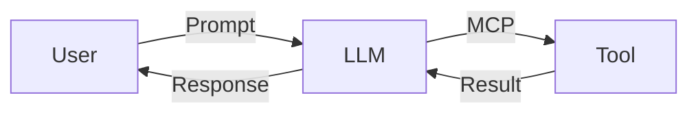
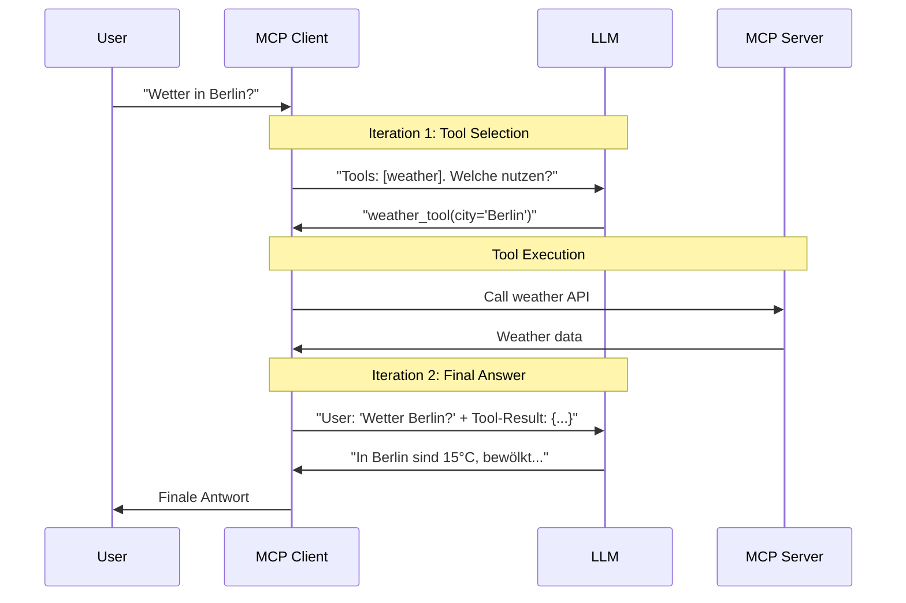
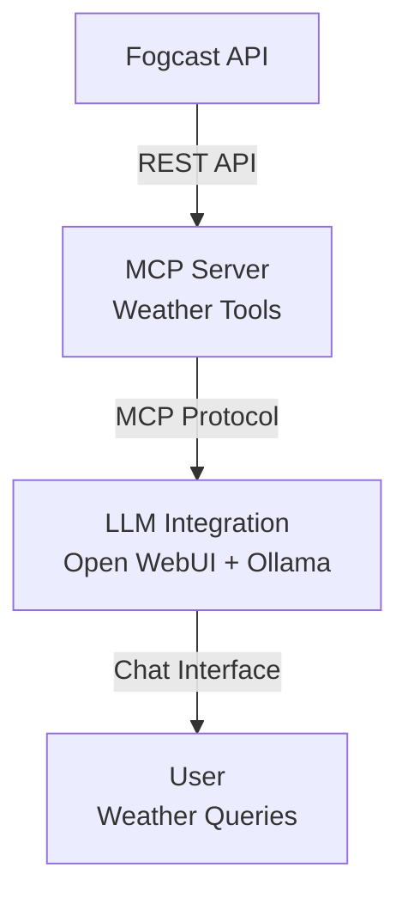

# LLM Workflows
## MCP Integration & Benchmarking

<div class="pt-12">
  <span class="px-2 py-1 rounded cursor-pointer bg-blue-600 text-white">
    Teamprojekt Zwischenpräsentation
  </span>
</div>

<div class="abs-br m-6 flex gap-2">
  <span class="text-sm opacity-50">HTWG Konstanz | SS 2025 & WS 2025/26</span>
</div>

---
layout: default
---

# Agenda

<div class="grid grid-cols-2 gap-8 pt-4">

<div>

## **Teil 1: Grundlagen**
<v-clicks>

- Projektübersicht
- MCP verstehen
- Infrastruktur & Setup

</v-clicks>
</div>

<div>

## **Teil 2: Entwicklung**
<v-clicks>

- Benchmarking-Framework
- Integration & Tools
- Ausblick & Diskussion

</v-clicks>
</div>

</div>

<style>
h2 {
  @apply text-blue-500 mb-4;
}
</style>

---
layout: default
class: text-left
---

# Projektkontext

<div class="grid grid-cols-2 gap-8 pt-4">

<div>

<v-click>

### Timeline
- **2 Semester** Projektlaufzeit
- **2-Wochen-Rhythmus** Meetings
- **Dynamische Anpassung** der Ziele & Vorgehen

</v-click>

<v-click>

### Team
- Prof. O. Dürr
- Prof. M. Franz
- Simon Driescher (MSI SE)
- Benedikt Scheffel (MSI SE)
- Robert Breuer (MSI ITM)

</v-click>

</div>

<div>

<v-click>

### 🎯 Projektziel
- State-of-the-Art LLM Workflows
- MCP (Model Context Protocol)
- n8n Workflow Automation
- Lokale LLM Kompetenz

</v-click>

</div>

</div>

---
layout: center
---

# Was ist MCP?
### Model Context Protocol

<div class="grid grid-cols-2 gap-8 mt-8">

<div class="bg-gray-800 p-6 rounded-lg">
<v-click>

## **Warum Tools für LLMs?**



**Erweitert LLM-Fähigkeiten** durch externe Tools

</v-click>
</div>

<div class="bg-gray-800 p-6 rounded-lg">
<v-click>

## **Transport-Typen**

- **stdio**: Subprocess-Kommunikation
- **HTTP**: REST/SSE Streaming

<div class="text-sm mt-4 opacity-80">
JSON-RPC basierte Kommunikation zwischen LLM und Tools
</div>

</v-click>
</div>

</div>

---
layout: default
---

# MCP-Clients: Protokoll-Ebene

<div class="grid grid-cols-2 gap-6 mt-4">

<div>
<v-click>

### **Client-Rolle**

- **Host Application** (Claude.ai, IDE)
- **Protokoll-Vermittler** LLM ↔ Server
- **Sicherheits-Controller** für Tools

</v-click>

<div class="mt-8"></div>

<v-click>

### **Client Features**

- **Sampling**: LLM-Anfragen durch Client
- **Roots**: Dateisystem-Boundaries  
- **Elicitation**: User-Interaktion on-demand

</v-click>
</div>

<div>
<v-click>

<h4 class="text-lg font-bold mb-2">Multi-Iteration Discovery</h4>

<div class="bg-gray-800 p-2 rounded-lg text-xs">

**1. Tool Discovery**
```
"Tools: [weather, calendar]
Welche für: 'Wetter Berlin?'"
```

**LLM Response:**
```
"weather_tool(city='Berlin')"
```

</div>

</v-click>

</div>

</div>

---
layout: default
---

#### MCP-Kommunikationsfluss
##### Der tatsächliche Ablauf im Detail

<div class="grid grid-cols-1" :class="$clicks >= 2 ? 'grid-cols-2 gap-6' : ''">

<div class="transition-all duration-1000 ease-in-out">

<v-click>



</v-click>

</div>

<div v-click="2" class="transition-all duration-1000 ease-in-out">

<h4 class="text-lg font-bold mb-4 text-orange-400">🔍 Wichtige Erkenntnisse</h4>

<div class="space-y-3">
  
<div class="bg-orange-900 bg-opacity-30 p-2 rounded-lg">
  <h5 class="font-semibold text-orange-200 mb-1 text-sm">Multi-Prompt Reality</h5>
  <p class="text-xs">Nicht ein Prompt → Mindestens zwei separate LLM-Aufrufe mit unterschiedlichen Kontexten</p>
  <p class="text-xs mt-1 text-orange-300"> Im Falle von PraisonAI inkl. LiteLLM </p>
</div>


<div class="bg-purple-900 bg-opacity-30 p-2 rounded-lg">
<h5 class="font-semibold text-purple-200 mb-1 text-sm">Client-Kontrolle</h5>
<p class="text-xs">MCP-Client steuert gesamten Workflow, nicht das LLM direkt</p>
</div>

</div>

</div>

</div>

<style>
/* Dynamisches Mermaid-Scaling */
.slidev-layout .mermaid {
  transform: scale(0.6);
  transform-origin: top left;
  transition: transform 1s ease-in-out;
}

/* Wenn 2-Spalten-Layout aktiv ist */
.grid-cols-2 .mermaid {
  transform: scale(1.0);
}
</style>

---
layout: default
---

## Unsere Infrastruktur
#### Evolution vom Einzelsystem zum Cluster

<div class="grid grid-cols-3 gap-3 mt-6">

<v-click>
<div class="bg-gradient-to-br from-gray-800 to-gray-900 p-3 rounded-lg">

<h4 class="text-lg font-bold mb-2">Phase 1: Start</h4>
<h5 class="text-base font-semibold mb-2">Ollama Workstation</h5>
<div class="text-sm">
- Intel Xeon E5-2667v4<br>
- NVIDIA Quadro P6000 (24GB)<br>
- Ollama + OpenWebUI
</div>

</div>
</v-click>

<v-click>
<div class="bg-gradient-to-br from-blue-800 to-blue-900 p-3 rounded-lg">

<h4 class="text-lg font-bold mb-2">Phase 2: Ausbau</h4>
<h5 class="text-base font-semibold mb-2">+ Atlas Server</h5>
<div class="text-sm">
- 2× Intel Xeon E5-2630v3<br>
- Tesla P100 + M10<br>
- vLLM Testing
</div>

</div>
</v-click>

<v-click>
<div class="bg-gradient-to-br from-green-800 to-green-900 p-3 rounded-lg">

<h4 class="text-lg font-bold mb-2">Phase 3: Aktuell</h4>
<h5 class="text-base font-semibold mb-2">+ GPU-PC01</h5>
<div class="text-sm">
- AMD Ryzen 9 5900X<br>
- RTX 3080 Ti<br>
- LibreChat Integration
</div>

</div>
</v-click>

</div>

<v-click>

<div class="mt-6 p-3 bg-purple-900 bg-opacity-30 rounded-lg">

<h4 class="text-lg font-bold mb-3">Stack & Tools Ecosystem</h4>

<div class="grid grid-cols-2 gap-4 text-sm">

<div>
<h5 class="font-semibold text-purple-200 mb-2">🤖 LLM Frameworks</h5>
<div class="space-y-1">
<div class="flex justify-between">
<span>Ollama</span> <span class="text-green-400">Primär</span>
</div>
<div class="flex justify-between">
<span>vLLM</span> <span class="text-yellow-400">Testing</span>
</div>
</div>

<h5 class="font-semibold text-purple-200 mb-2 mt-3">🌐 Web Interfaces</h5>
<div class="space-y-1">
<div class="flex justify-between">
<span>OpenWebUI</span> <span class="text-blue-400">Simpel</span>
</div>
<div class="flex justify-between">
<span>LibreChat</span> <span class="text-blue-400">Skalierend</span>
</div>
</div>
</div>

<div>
<h5 class="font-semibold text-purple-200 mb-2">⚙️ Automation & Tools</h5>
<div class="space-y-1">
<div class="flex justify-between">
<span>n8n</span> <span class="text-green-400">Workflows</span>
</div>
<div class="flex justify-between">
<span>LLM & MCP Benchmark</span> <span class="text-orange-400">Evaluierung</span>
</div>
</div>

<h5 class="font-semibold text-purple-200 mb-2 mt-3">🔗 Protokolle & Bridges</h5>
<div class="space-y-1">
<div class="flex justify-between">
<span>MCP Protocol</span> <span class="text-cyan-400">stdio/HTTP</span>
</div>
<div class="flex justify-between">
<span>MCPO Bridge</span> <span class="text-cyan-400">MCP→OpenAPI</span>
</div>
</div>
</div>

</div>

</div>

</v-click>

---
layout: default
---

## Erste Schritte: Demo-Tools

<div class="grid grid-cols-2 gap-4 mt-3">

<div>
<v-click>

#### **Implementierte MCPs**
- Wetterdaten-Tool
- HTWG Mensa-Tool

</v-click>

<div class="mt-12"></div>

<v-click>

#### **Learnings**
- Tool-Definition & Schema
- Integration zusammen mit Ollama 
  - OpenWebUI + Python
- Debugging der Kommunikation

</v-click>
</div>

<div>
<v-click>

#### **Code-Beispiel**

```python {all|3-4|7-11|all}
Tool(
    name="get_weather",
    description="Ruft aktuelle Wetterdaten 
                 für eine Stadt ab",
    inputSchema={
        "type": "object",
        "properties": {
            "city": {"type": "string", 
                    "description": "Name der Stadt"}
        },
        "required": ["city"]
    }
)
```

</v-click>
</div>

</div>

<v-click>

<div class="mt-3 text-center text-xs opacity-60">
**Erkenntnis**: Tool-Definition ist simpel, aber robuste Integration erfordert Verständnis der Kommunikation
</div>

</v-click>

---
layout: default
---

# Benchmarking-Framework entwickelt

<div class="grid grid-cols-1 gap-4 mt-4">

<div class="grid grid-cols-2 gap-6">

<div>
<v-clicks>

#### **Phase 1: Standard LLM Tests**
- Antwortqualität
- Performance-Metriken  
- Multi-Model Vergleiche

<div class="mt-6"></div>

#### **Phase 2: MCP-Erweiterung**
- Tool-Nutzung evaluieren
- Result-Interpretation prüfen
- Zuverlässigkeit messen

</v-clicks>
</div>

<div>
<v-click>

#### **Herausforderung**

<div class="bg-red-900 bg-opacity-30 p-3 rounded-lg">

<div class="font-semibold text-sm">Qualitative Evaluation</div>
<div class="text-xs">
• Keine eindeutigen Metriken<br>
• Subjektive Bewertungen<br>  
• Kontextabhängige Korrektheit
</div>

</div>

</v-click>
</div>

</div>

<v-click>

<div class="mt-4 bg-green-900 bg-opacity-30 p-3 rounded-lg">

#### **Lösung: Multi-Model Cross-Validation**

<div class="text-m">
• Modelle bewerten sich gegenseitig<br>
• Konsens-basierte Scores<br>
• Robustere Ergebnisse
</div>

</div>

</v-click>

</div>

---
layout: default
---

# Benchmark-Ergebnisse
* [Email Benchmark](http://192.168.50.117:8021/email_benchmark.html)
* [MCP Benchmark](http://192.168.50.117:8021/mcp_benchmark.html)

---
layout: center
---

# n8n Integration

<div class="grid grid-cols-3 gap-4 mt-8">

<v-click>
<div class="bg-blue-900 bg-opacity-30 p-6 rounded-lg">

### **Workflow-Automation**
- Visual Programming
- No-Code Ansatz
- 400+ Integrationen

</div>
</v-click>

<v-click>
<div class="bg-green-900 bg-opacity-30 p-6 rounded-lg">

### **Fair-Use Lizenz**
- Sustainable Model
- Self-Hosting möglich
- Alternative zu Zapier

</div>
</v-click>

<v-click>
<div class="bg-purple-900 bg-opacity-30 p-6 rounded-lg">

### **LLM Integration**
- Komplexe Workflows
- Multi-Step Processing
- Tool-Chaining
- Flexible Modelauswahl

</div>
</v-click>

</div>
TODO: Mehr zu n8n passiert? Evtl. warum aktuell nichts damit passiert?

---
layout: default
---

# Aktuelles Projekt: Weather-Forecast MCP

<div class="grid grid-cols-2 gap-8 mt-6">

<div>
<v-clicks>

**Kooperation mit Wetterstation-Teamprojekt**

- Echte Sensordaten der HTWG
- Forecast-Modelle integrieren
- LLM-basierte Interpretation

**Verfügbeare Tools**

- get_current_weather - Gibt die aktuellen Wetterdaten zurück
- get_forcast_summary - Gibt eine Vorhersage für ein besimmtes Datum zurück
- get_weather_summary - Gibt historische Wetterdaten zurück

</v-clicks>
</div>

<div>
<v-click>

### **Architektur**

<div class="bg-gray-800 p-4 rounded-lg">
Architektur-Diagramm 

</div>
<a href="https://ollama.ios.htwg-konstanz.de:3000" target="_blank">
<div class="mt-4 p-3 bg-yellow-900 bg-opacity-30 rounded flex flex-col items-center justify-center text-center">
  📺 Live Demo
</div>
  </a>

</v-click>
</div>

</div>

---
layout: default
---

# Learnings & Herausforderungen

<div class="grid grid-cols-3 gap-4 mt-8">

<v-click>
<div class="bg-red-900 bg-opacity-20 p-6 rounded-lg">

### **Evaluation**

**Qualitative Evaluation ist komplex**
- Subjektive Metriken
- Kontextabhängigkeit
- Ground Truth fehlt oft

</div>
</v-click>

<v-click>
<div class="bg-yellow-900 bg-opacity-20 p-6 rounded-lg">

### **Kompatibilität**

**MCP-Kompatibilität ???**
TODO Benchmark results interpretieren
- Noch offen
- Modell-spezifisch
- Standards entwickeln sich

</div>
</v-click>

<v-click>
<div class="bg-blue-900 bg-opacity-20 p-6 rounded-lg">

### **Realität**

**MCP ist der richtige Schritt**
- Simple Technologie, große Wirkung
- **Ein** Standard für **alle** Clients
- Demokratisiert Tool-Zugriff für LLMs
</div>
</v-click>

</div>

<v-click>

<div class="mt-8 text-center text-lg">
**Erkenntnis**: Erfolg hängt von sorgfältiger Implementierung ab, nicht von der Technologie allein. (Ähnlichkeit zum Prompt Engineering)
</div>

</v-click>

---
layout: default
---

#  **Ideen & Möglichkeiten**

<div class="grid grid-cols-2 gap-8 mt-8">

<div>
<v-click>

### Offene Fragen

- **Wohin entwickeln wir uns?**
  - Forschung vertiefen?
  - Praktische Anwendung?
  - Tool-Entwicklung?

- **Was macht am meisten Sinn?**
  - Für die HTWG?
  - Für das Lernen?


</v-click>
</div>

<div>
<v-click>

### Gesammelte Ideen

<div class="space-y-2 text-sm">
<div class="bg-gray-800 p-2 rounded">
• Hochschul-Services (LSF, Moodle)
</div>
<div class="bg-gray-800 p-2 rounded">
• IoT-Integration
</div>
<div class="bg-gray-800 p-2 rounded">
• Paperless/Dokumenten-KI
</div>
<div class="bg-gray-800 p-2 rounded">
• Weather-MCP erweitern?
</div>
<div class="bg-gray-800 p-2 rounded">
• n8n Workflows
</div>
</div>

</v-click>
</div>

</div>

<v-click>

<div class="mt-2 p-4 bg-gradient-to-r from-blue-900 to-purple-900 bg-opacity-30 rounded-lg text-center">
<div class="text-lg">
• <strong>Welche Tools würdet Ihr gerne integriert sehen?</strong><br>
• <strong>Wo seht Ihr das größte Potential für MCP?</strong><br>
• <strong>Alternative Pfade zu MCP|Tools?</strong>
</div>
</div>

</v-click>
